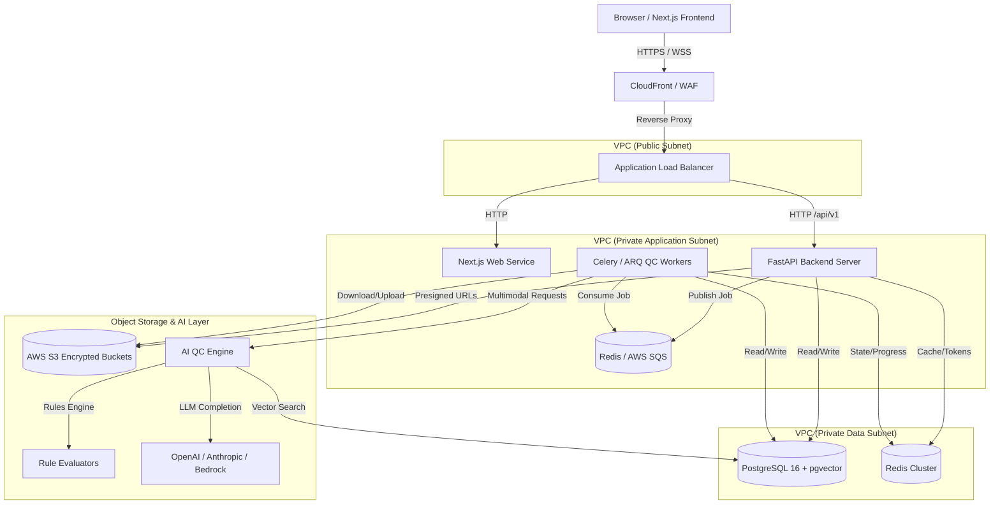
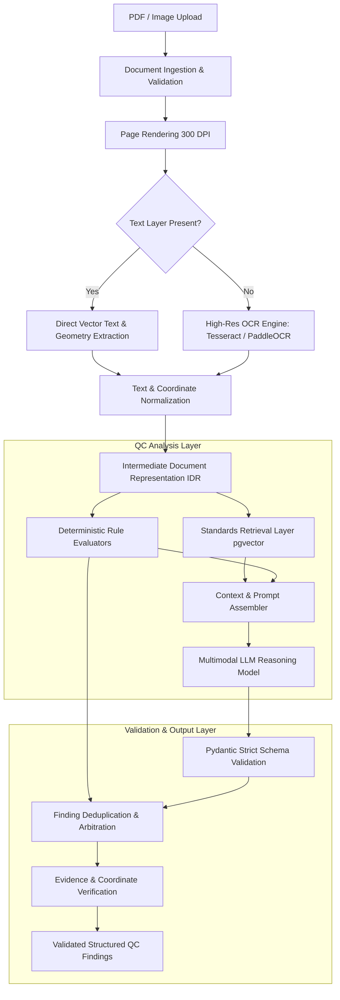
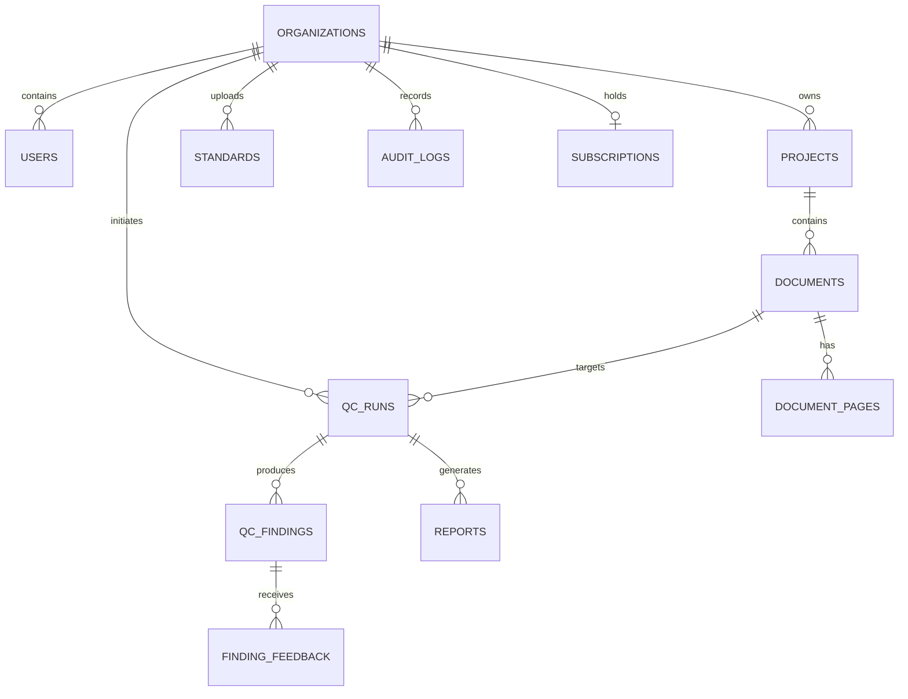
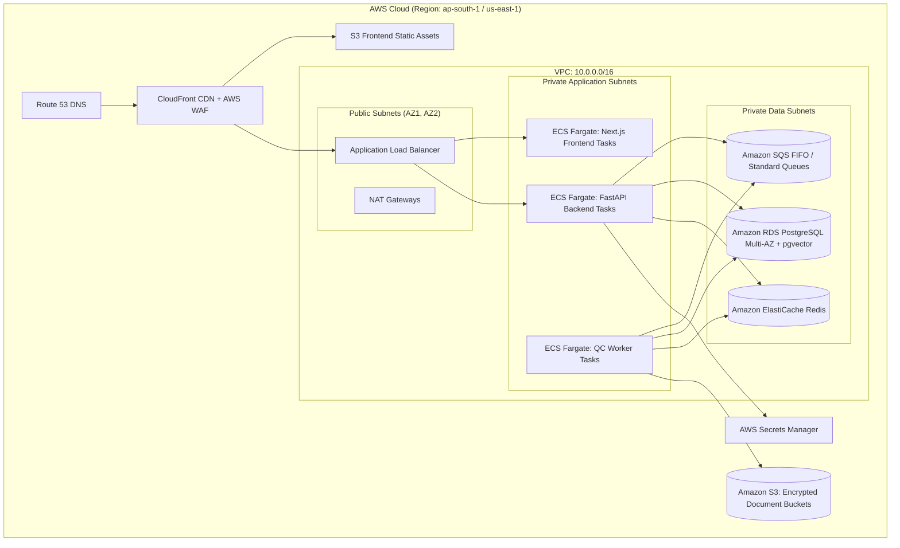

# WIRING DIAGRAM QC ASSISTANT — TECHNICAL DESIGN SPECIFICATION v1.0
**Project Charter & Architecture Master Specification**
*Document Version: 1.0.0 | Date: 2026-09-25 | Target System: Multi-Tenant B2B AI SaaS*
*Stakeholders: Spandsons Horizon Engineering Pvt. Ltd. (Pravin, Gogulnath, Engineering Leadership)*

---

## 1. EXECUTIVE TECHNICAL SUMMARY

The **Wiring Diagram QC Assistant** is a commercial-grade, multi-tenant B2B AI-powered SaaS platform engineered to automate compliance verification, defect detection, and quality assurance for electrical wiring diagram manuals, wire harness drawings, and industrial panel schematics.

### Core Problem & Business Thesis
Today, quality control (QC) of wiring manuals in electronics manufacturing services (EMS), panel building, automotive harness assembly, aerospace, and industrial automation is overwhelmingly manual, error-prone, and reliant on scarce domain experts. Manual reviews of 20–100 page schematics require hours of tedious inspection to cross-reference wire gauges, crimp terminal part numbers, color codes, reference designators, and industry standards (e.g., IPC-WHMA-A-620, IPC-A-610, UL 508A).

### Architectural Philosophy: Rejecting the "Naive LLM" Trap
A central mandate of this system is that **engineering QC cannot rely on a naive `PDF -> LLM -> arbitrary text` pattern**. LLMs alone are prone to hallucinating citations, missing dense spatial relations, and failing on high-precision numerical engineering constraints. 

Instead, the system employs a **Defense-in-Depth AI Architecture**:
1. **Deterministic Pre-Processing & OCR/Vision Layer**: Accurate text, coordinate, and vector extraction.
2. **Intermediate Document Representation (IDR)**: Normalized tabular, spatial, and relational model of components, nets, and title blocks.
3. **Deterministic Rule Engine**: Hard constraints (e.g., missing wire gauge, pin mismatch) evaluated programmatically.
4. **Targeted Domain RAG**: Standards and customer SOPs retrieved with strict provenance and tenant isolation.
5. **Multimodal LLM Reasoning**: Applied only to contextual visual synthesis, diagram interpretation, and standards reasoning with strict schema enforcement (Pydantic).
6. **Output Validation & Confidence Scoring**: Re-verifying references, coordinates, and bounding boxes before report emission.
7. **Human-in-the-Loop Feedback & Active Learning**: Recording inspector overrides to power ongoing evaluation and regression testing.

---

## 2. PRODUCT SCOPE

### 2.1 In-Scope (Phase 1 through Production v1)
* **Document Ingestion**: Single-page and multi-page engineering manuals in PDF (vector/digital and scanned/raster), PNG, and JPG formats.
* **Extraction & Recognition**: Title block metadata, wire numbers, wire gauges, color codes, connectors, terminals, pin schedules, bill of materials (BOM) tables, notes, and revision blocks.
* **Compliance Checks**:
  * Industry standards presets: IPC-WHMA-A-620 (Wire Harness Assemblies), IPC-A-610 (Electronic Assemblies), UL 508A (Industrial Control Panels).
  * Customer-specific standard operating procedures (SOPs) and drawing guidelines.
* **Structured Findings**: Each discrepancy output with unique ID, severity (Critical, Major, Minor, Info), confidence score, page number, bounding box coordinates $(x, y, w, h)$, direct standard requirement citation, and plain-language engineering recommendation.
* **Interactive Discrepancy Viewer**: Web-based split-view UI displaying the original rendered diagram with interactive bounding box overlays synced to a finding list.
* **Export Engine**: Deterministic generation of audit-ready PDF reports and structured XLSX spreadsheets.
* **Multi-Tenancy & Security**: Strict logical tenant isolation, Role-Based Access Control (RBAC), end-to-end audit logging, and private encrypted object storage.
* **Commercial Capabilities**: Usage tracking, pay-per-check billing, and tiered monthly recurring subscriptions.

### 2.2 Out-of-Scope (Explicitly Deferred)
* Generative CAD editing / schematic authoring (e.g., competing with AutoCAD Electrical, EPLAN, or Zuken).
* Physical assembly line computer vision (e.g., inspecting physical crimps on a conveyor belt via factory cameras).
* Speculative Graph Neural Networks (GNNs) prior to establishing a robust rule + vision baseline.
* Direct cloud-to-factory SCADA/PLC integration.

---

## 3. USER PERSONAS & ACCESS PROFILES

| Persona | Role | Primary Goals | Key Workflows & Permissions |
|---|---|---|---|
| **Rajesh**<br>Senior QC Inspector | `INSPECTOR` | Rapid, exhaustive verification of incoming drawing revisions; zero missed critical defects. | Uploads drawings, triggers QC runs, reviews flagged discrepancies, marks findings Correct/Incorrect with notes, exports PDF/XLSX. |
| **Ananya**<br>EMS Production Manager | `ENGINEER` | Minimizing rework, tracking team turnaround time, resolving customer compliance disputes. | Views project dashboards, tracks pass/fail rates across manufacturing batches, reviews high-severity flags, invites project engineers. |
| **Vikram**<br>VP of Quality & Standards | `ADMIN` | Enforcing corporate SOPs across facilities, maintaining regulatory audit trails. | Configures organization standards, uploads proprietary SOPs, customizes rule severities, audits user activities. |
| **Pravin**<br>Platform / Org Owner | `OWNER` | Account management, license provisioning, billing reconciliation. | Manages subscription tiers, purchases check credits, views cost/usage telemetry, controls organization membership. |
| **System Admin**<br>Spandsons Super Admin | `SUPER_ADMIN` | Platform health, AI evaluation benchmarks, rule catalog updates. | Cross-tenant platform metrics, model routing configurations, evaluation suite monitoring. No access to customer drawings. |

---

## 4. FUNCTIONAL REQUIREMENTS (FR)

* **FR-01: Authentication & Org Provisioning**: Secure registration, email verification, login with JWT/session cookies, password reset, and organization creation/invitation workflows.
* **FR-02: Document Ingestion**: Upload of PDF, PNG, and JPG files up to 50MB and 100 pages per document. Validates MIME type, file magic bytes, and scans against decompression bombs.
* **FR-03: Dual-Mode Parsing & OCR**: Automatically detects whether a PDF contains digital text/vector vectors or scanned raster imagery. Applies high-resolution rendering (300 DPI) and OCR (Tesseract / PaddleOCR) with word-level bounding boxes.
* **FR-04: Structured Document Modeling**: Parses drawing pages into an Intermediate Document Representation (IDR) detailing Title Block, Revision Table, Notes List, Wire Callouts, Connectors, and BOM Tables.
* **FR-05: Standards Selection**: Allows users to select standard presets (IPC-620, IPC-610, UL 508A) or organization-specific SOP documents.
* **FR-06: Asynchronous QC Job Queueing**: Long-running QC checks are enqueued to background workers via message queue (SQS/Redis). Returns a `job_id` immediately; provides real-time progress (0–100%) via Server-Sent Events (SSE).
* **FR-07: Deterministic Rule Execution**: Runs rule logic for explicit engineering constraints (e.g., wire gauge missing, unlinked terminal, color code mismatch).
* **FR-08: Multimodal LLM Reasoning**: Passes extracted drawing elements, cropped diagram regions, and retrieved standard clauses to an LLM with strict Pydantic schema constraints.
* **FR-09: Schema-Enforced Finding Validation**: Synthesizes rule and LLM outputs, validates that citations exist, filters duplicates, and calculates composite confidence scores.
* **FR-10: Interactive Web QC Viewer**: Displays the document with pan/zoom and canvas-based bounding box overlays corresponding to selected discrepancies.
* **FR-11: Deterministic Export**:
  * **PDF Report**: Audit-ready executive summary, pass/fail status, severity charts, and detailed findings with page crops and citations.
  * **XLSX Report**: Clean tabular export of all checks, findings, locations, and severities for ERP/PLM import.
* **FR-12: Human Feedback Loop**: Users can mark any finding as `CORRECT`, `INCORRECT` (False Positive), or `NEEDS_REVIEW` with an optional explanation, logging events to the evaluation dataset.
* **FR-13: Audit Trail**: Every document upload, QC run, finding modification, and report export is recorded with user ID, organization ID, timestamp, IP, and action metadata.
* **FR-14: Usage Tracking & Metering**: Tracks checks performed, token consumption, OCR execution time, and enforces pay-per-check and subscription tier quotas.

---

## 5. NON-FUNCTIONAL REQUIREMENTS (NFR)

* **NFR-01: Performance**:
  * Single-page diagram QC turnaround: $\le 30\text{ seconds}$ (p90).
  * 10-page manual QC turnaround: $\le 180\text{ seconds}$ (p90).
  * API query response time: $\le 200\text{ ms}$ (p95) for all non-AI endpoints.
  * PDF/XLSX export generation: $\le 5\text{ seconds}$.
* **NFR-02: Availability**: 99.9% uptime target for web and API services.
* **NFR-03: Scalability**: Worker pool scales horizontally based on queue depth. SQS/Redis task queue absorbs upload spikes without dropping jobs.
* **NFR-04: Security & Tenant Isolation**: Zero cross-tenant data leakage. Database enforced by tenant-scoped queries and Row Level Security (RLS). Storage paths partitioned by `organization_id`.
* **NFR-05: Data Privacy**: Customer documents are strictly isolated. External LLM calls use enterprise APIs with zero data retention for model training agreements.
* **NFR-06: Idempotency**: QC runs and payment webhooks are strictly idempotent using unique request/transaction keys.
* **NFR-07: Accuracy & Reproducibility**: Every QC run stores its `model_version`, `prompt_version`, `rules_version`, and `standards_version`. Re-running the exact same version set on a document yields deterministic rule results.

---

## 6. SYSTEM ARCHITECTURE

The platform is designed as a modular, cloud-native system using clean architecture principles.



### Component Breakdown
1. **Frontend**: Next.js 14+ (App Router), TypeScript, responsive B2B interface with PDF.js canvas viewer, Tailwind CSS / Vanilla CSS design system.
2. **Backend API**: Python 3.11+ / FastAPI, Pydantic v2 schemas, SQLAlchemy 2.0 async ORM, Alembic migrations.
3. **Queue & Background Workers**: Redis / Celery (or ARQ) worker processes executing containerized OCR, computer vision, and AI inference tasks.
4. **Primary Database**: PostgreSQL 16 with `pgvector` extension for standard embeddings, relational data, and JSONB audit logs.
5. **Object Storage**: S3-compatible storage (AWS S3 in production, MinIO in local dev) with Server-Side Encryption (KMS / AES-256) and strict private bucket policies.

---

## 7. AI ENGINE ARCHITECTURE

The AI QC Engine operates as a pipeline of discrete, verifiable stages:



### 7.1 Multi-Provider AI Abstraction
To prevent vendor lock-in and enable dynamic routing (cost vs. capability), all LLM calls pass through an abstract adapter interface:

```python
from abc import ABC, abstractmethod
from typing import Any, Dict, List
from pydantic import BaseModel

class LLMRequest(BaseModel):
    system_prompt: str
    user_prompt: str
    images: List[bytes] = []
    temperature: float = 0.0
    response_schema: Dict[str, Any]

class LLMResponse(BaseModel):
    raw_content: str
    structured_data: Dict[str, Any]
    prompt_tokens: int
    completion_tokens: int
    total_tokens: int
    latency_ms: float
    model_name: str
    provider: str

class LLMProviderInterface(ABC):
    @abstractmethod
    async def generate_structured(self, request: LLMRequest) -> LLMResponse:
        """Execute structured output completion adhering strictly to schema."""
        pass
```

Implementations:
* `OpenAIProvider`: Implements `gpt-4o` / `gpt-4o-mini` with `response_format={"type": "json_schema"}`.
* `AnthropicProvider`: Implements `claude-3-5-sonnet` with tool use for structured JSON extraction.
* `GoogleGeminiProvider`: Implements `gemini-1.5-pro` / `gemini-1.5-flash` with structured outputs.
* `SelfHostedProvider`: vLLM / Ollama wrapper using JSON grammar-constrained decoding.

---

## 8. DOCUMENT-PROCESSING ARCHITECTURE

### 8.1 Ingestion Security & Validation Pipeline
1. **MIME & Magic Byte Verification**: Scans headers using `python-magic` to prevent extension spoofing. Permitted: `application/pdf`, `image/png`, `image/jpeg`.
2. **Decompression Bomb Protection**: Checks image pixel dimensions $(\le 10,000 \times 10,000\text{ px})$ and uncompressed PDF stream sizes $(\le 200\text{ MB})$.
3. **Malware Scanning Hook**: Streamed through ClamAV daemon container before persisting to S3.
4. **Storage Partitioning**: Files saved to:
   `s3://{BUCKET}/tenants/{org_id}/documents/{document_id}/original/{safe_filename}`
5. **Page Rendering**: Multi-page PDFs are rasterized to PNGs at 300 DPI using `pypdfium2` / `pdf2image` and saved to:
   `s3://{BUCKET}/tenants/{org_id}/documents/{document_id}/pages/page_{page_num}.png`

### 8.2 Intermediate Document Representation (IDR)
The system parses raw drawing pages into an internal structured format:
```json
{
  "document_id": "doc_12345",
  "page_count": 1,
  "pages": [
    {
      "page_number": 1,
      "width": 3300,
      "height": 2550,
      "title_block": {
        "drawing_number": "WD-8820-01",
        "title": "MAIN HARNESS SCHEMATIC",
        "revision": "B",
        "drawn_by": "J. Doe",
        "approved_by": "M. Smith",
        "date": "2025-08-10"
      },
      "detected_elements": {
        "wire_callouts": [
          {"id": "w1", "text": "W101 18AWG RED", "gauge": "18AWG", "color": "RED", "wire_num": "W101", "bbox": [450, 620, 180, 30]}
        ],
        "connectors": [
          {"id": "c1", "ref_des": "J1", "part_number": "MS3106A-20-29P", "pin_count": 17, "bbox": [200, 500, 120, 240]}
        ],
        "general_notes": [
          {"note_number": 1, "text": "ALL WIRES TO BE TEFLON INSULATED PER MIL-W-22759."}
        ]
      }
    }
  ]
}
```

---

## 9. RAG & STANDARDS RETRIEVAL ARCHITECTURE

### 9.1 Standards Ingestion & Chunking
* **Hierarchical Chunking**: Unlike generic token-window chunking, engineering standards (IPC-WHMA-A-620, UL 508A) are chunked **by section clause** (e.g., Section 13.5.2 "Terminal Lug Crimp Heights").
* **Metadata Schema**:
  ```json
  {
    "standard_id": "IPC-620",
    "version": "D",
    "section": "4.2.1",
    "section_title": "Wire Gauge and Current Carrying Capacity",
    "scope": "GLOBAL",
    "organization_id": null
  }
  ```
* **Tenant Isolation in RAG**: Global standards have `organization_id = NULL` and `is_public = TRUE`. Customer proprietary SOPs have `organization_id = {customer_org_id}` and `is_public = FALSE`. All vector queries enforce:
  ```sql
  WHERE (organization_id = :current_tenant_id OR is_public = TRUE)
  ```
  Company A can never retrieve Company B's uploaded standards.

---

## 10. QC RULES ARCHITECTURE

Rules are maintained in a versioned, declarative registry. Each rule executes against the IDR and context chunks.

### Sample Core Rules

| Rule ID | Rule Name | Category | Severity | Evaluation Logic | Applicable Standard |
|---|---|---|---|---|---|
| `RULE-WG-001` | Missing Wire Gauge | `WIRE_SPEC` | **CRITICAL** | Every identified wire run must specify an AWG or metric cross-section. | IPC-620 § 4.1 |
| `RULE-TT-002` | Terminal Part Mismatch | `TERMINAL` | **MAJOR** | Crimp terminal rating must accommodate the specified wire gauge range. | IPC-620 § 13.4 |
| `RULE-CC-003` | Color Code Ambiguity | `COLOR_CODE` | **MAJOR** | Wire color abbreviations must match standard abbreviations (BLK, WHT, RED, BLU). | UL 508A § 66.5 |
| `RULE-RD-004` | Duplicate RefDes | `DESIGNATOR` | **CRITICAL** | Component reference designators (e.g., J1, K1) must be unique across the assembly. | ANSI/IEEE 200 |
| `RULE-TB-005` | Incomplete Title Block | `DOCUMENTATION`| **MINOR** | Drawing Number, Rev, Drawn By, and Date fields must not be blank or "TBD". | ISO 7200 / Company SOP |

---

## 11. DATA MODEL (POSTGRESQL SCHEMA)



### PostgreSQL DDL Specification

```sql
-- Extensions
CREATE EXTENSION IF NOT EXISTS "uuid-ossp";
CREATE EXTENSION IF NOT EXISTS "pgcrypto";
CREATE EXTENSION IF NOT EXISTS "vector";

-- Organizations (Tenants)
CREATE TABLE organizations (
    id UUID PRIMARY KEY DEFAULT gen_random_uuid(),
    name VARCHAR(255) NOT NULL,
    slug VARCHAR(100) UNIQUE NOT NULL,
    plan_tier VARCHAR(50) DEFAULT 'PAY_PER_CHECK',
    credits_remaining INTEGER DEFAULT 3,
    created_at TIMESTAMPTZ DEFAULT CURRENT_TIMESTAMP,
    updated_at TIMESTAMPTZ DEFAULT CURRENT_TIMESTAMP
);

-- Users
CREATE TABLE users (
    id UUID PRIMARY KEY DEFAULT gen_random_uuid(),
    email VARCHAR(255) UNIQUE NOT NULL,
    password_hash VARCHAR(255) NOT NULL,
    full_name VARCHAR(255) NOT NULL,
    role VARCHAR(50) NOT NULL DEFAULT 'INSPECTOR', -- OWNER, ADMIN, ENGINEER, INSPECTOR, VIEWER, SUPER_ADMIN
    organization_id UUID NOT NULL REFERENCES organizations(id) ON DELETE CASCADE,
    is_active BOOLEAN DEFAULT TRUE,
    created_at TIMESTAMPTZ DEFAULT CURRENT_TIMESTAMP
);

CREATE INDEX idx_users_org ON users(organization_id);

-- Projects
CREATE TABLE projects (
    id UUID PRIMARY KEY DEFAULT gen_random_uuid(),
    organization_id UUID NOT NULL REFERENCES organizations(id) ON DELETE CASCADE,
    name VARCHAR(255) NOT NULL,
    description TEXT,
    created_at TIMESTAMPTZ DEFAULT CURRENT_TIMESTAMP
);

CREATE INDEX idx_projects_org ON projects(organization_id);

-- Documents
CREATE TABLE documents (
    id UUID PRIMARY KEY DEFAULT gen_random_uuid(),
    organization_id UUID NOT NULL REFERENCES organizations(id) ON DELETE CASCADE,
    project_id UUID NOT NULL REFERENCES projects(id) ON DELETE CASCADE,
    uploaded_by UUID NOT NULL REFERENCES users(id),
    filename VARCHAR(255) NOT NULL,
    file_size_bytes BIGINT NOT NULL,
    mime_type VARCHAR(100) NOT NULL,
    sha256_checksum VARCHAR(64) NOT NULL,
    storage_path VARCHAR(512) NOT NULL,
    page_count INTEGER DEFAULT 1,
    status VARCHAR(50) DEFAULT 'UPLOADED', -- UPLOADED, VALIDATING, PROCESSING, COMPLETED, FAILED
    created_at TIMESTAMPTZ DEFAULT CURRENT_TIMESTAMP
);

CREATE INDEX idx_documents_org ON documents(organization_id);
CREATE INDEX idx_documents_checksum ON documents(organization_id, sha256_checksum);

-- Standards & Chunks (RAG)
CREATE TABLE standards (
    id UUID PRIMARY KEY DEFAULT gen_random_uuid(),
    organization_id UUID REFERENCES organizations(id) ON DELETE CASCADE, -- NULL means global
    code VARCHAR(100) NOT NULL, -- e.g. IPC-WHMA-A-620
    version VARCHAR(50) NOT NULL, -- e.g. D
    title VARCHAR(255) NOT NULL,
    is_public BOOLEAN DEFAULT FALSE,
    created_at TIMESTAMPTZ DEFAULT CURRENT_TIMESTAMP
);

CREATE TABLE standard_chunks (
    id UUID PRIMARY KEY DEFAULT gen_random_uuid(),
    standard_id UUID NOT NULL REFERENCES standards(id) ON DELETE CASCADE,
    section_number VARCHAR(100) NOT NULL,
    title VARCHAR(255) NOT NULL,
    content TEXT NOT NULL,
    embedding vector(1536),
    created_at TIMESTAMPTZ DEFAULT CURRENT_TIMESTAMP
);

CREATE INDEX idx_standard_chunks_embedding ON standard_chunks USING hnsw (embedding vector_cosine_ops);

-- QC Runs
CREATE TABLE qc_runs (
    id UUID PRIMARY KEY DEFAULT gen_random_uuid(),
    organization_id UUID NOT NULL REFERENCES organizations(id) ON DELETE CASCADE,
    document_id UUID NOT NULL REFERENCES documents(id) ON DELETE CASCADE,
    initiated_by UUID NOT NULL REFERENCES users(id),
    overall_status VARCHAR(50) NOT NULL DEFAULT 'QUEUED', -- QUEUED, PROCESSING, PASS, FAIL, REVIEW_REQUIRED, FAILED
    checks_total INTEGER DEFAULT 0,
    checks_passed INTEGER DEFAULT 0,
    checks_failed INTEGER DEFAULT 0,
    checks_review INTEGER DEFAULT 0,
    model_version VARCHAR(100) NOT NULL,
    prompt_version VARCHAR(50) NOT NULL,
    rules_version VARCHAR(50) NOT NULL,
    estimated_cost_usd NUMERIC(10, 4) DEFAULT 0.0,
    token_usage_total INTEGER DEFAULT 0,
    processing_time_ms INTEGER DEFAULT 0,
    created_at TIMESTAMPTZ DEFAULT CURRENT_TIMESTAMP,
    completed_at TIMESTAMPTZ
);

CREATE INDEX idx_qc_runs_org ON qc_runs(organization_id);
CREATE INDEX idx_qc_runs_doc ON qc_runs(document_id);

-- QC Findings
CREATE TABLE qc_findings (
    id UUID PRIMARY KEY DEFAULT gen_random_uuid(),
    qc_run_id UUID NOT NULL REFERENCES qc_runs(id) ON DELETE CASCADE,
    rule_id VARCHAR(100) NOT NULL,
    category VARCHAR(100) NOT NULL,
    description TEXT NOT NULL,
    severity VARCHAR(50) NOT NULL, -- CRITICAL, MAJOR, MINOR, INFO
    confidence_level VARCHAR(20) NOT NULL, -- HIGH, MEDIUM, LOW
    confidence_score NUMERIC(4, 3) NOT NULL,
    page_number INTEGER NOT NULL,
    location_bbox JSONB, -- {x: int, y: int, width: int, height: int}
    evidence_text TEXT NOT NULL,
    requirement_text TEXT NOT NULL,
    standard_citation VARCHAR(255) NOT NULL,
    recommendation TEXT NOT NULL,
    created_at TIMESTAMPTZ DEFAULT CURRENT_TIMESTAMP
);

CREATE INDEX idx_qc_findings_run ON qc_findings(qc_run_id);

-- Human Feedback
CREATE TABLE finding_feedback (
    id UUID PRIMARY KEY DEFAULT gen_random_uuid(),
    finding_id UUID NOT NULL REFERENCES qc_findings(id) ON DELETE CASCADE,
    user_id UUID NOT NULL REFERENCES users(id),
    feedback_status VARCHAR(50) NOT NULL, -- CORRECT, INCORRECT, NEEDS_REVIEW
    reason TEXT,
    created_at TIMESTAMPTZ DEFAULT CURRENT_TIMESTAMP
);

-- Audit Logs
CREATE TABLE audit_logs (
    id UUID PRIMARY KEY DEFAULT gen_random_uuid(),
    organization_id UUID NOT NULL REFERENCES organizations(id) ON DELETE CASCADE,
    actor_id UUID REFERENCES users(id),
    action VARCHAR(100) NOT NULL,
    resource_type VARCHAR(100) NOT NULL,
    resource_id UUID NOT NULL,
    ip_address VARCHAR(45),
    request_id VARCHAR(100),
    metadata JSONB DEFAULT '{}'::jsonb,
    created_at TIMESTAMPTZ DEFAULT CURRENT_TIMESTAMP
);

CREATE INDEX idx_audit_org_created ON audit_logs(organization_id, created_at DESC);
```

---

## 12. API ARCHITECTURE & SPECIFICATIONS

All endpoints are versioned under `/api/v1/` and enforce JSON schemas.

### 12.1 Authentication & Tenant Routes
* `POST /api/v1/auth/register`: Create initial user and organization.
* `POST /api/v1/auth/login`: Authenticate and return secure HTTP-only cookies and JWT.
* `GET  /api/v1/auth/me`: Fetch current user, organization, and permissions.
* `POST /api/v1/organizations/members`: Invite user to organization with specific role.

### 12.2 Document Management Routes
* `POST /api/v1/documents/upload-intent`: Request a presigned S3 upload URL.
  * *Request*: `{ filename: str, file_size: int, mime_type: str, project_id: UUID }`
  * *Response*: `{ document_id: UUID, presigned_url: str, upload_fields: dict }`
* `POST /api/v1/documents/{document_id}/confirm`: Confirm upload completion; initiates validation & page rasterization.
* `GET  /api/v1/documents`: List documents with pagination, project filtering, and status.
* `GET  /api/v1/documents/{document_id}/pages/{page_num}`: Return presigned URL for rendered 300 DPI page image.

### 12.3 QC Engine & Results Routes
* `POST /api/v1/qc-runs`: Trigger a new QC analysis.
  * *Request*: `{ document_id: UUID, standards: ["IPC-620", "UL-508A"], custom_ruleset_id: Optional[UUID] }`
  * *Response*: `{ qc_run_id: UUID, status: "QUEUED", estimated_wait_sec: 15 }`
* `GET  /api/v1/qc-runs/{qc_run_id}`: Poll QC run status, pass/fail counts, and summary.
* `GET  /api/v1/qc-runs/{qc_run_id}/stream`: Server-Sent Events (SSE) stream for real-time progress updates.
* `GET  /api/v1/qc-runs/{qc_run_id}/findings`: List structured findings with severity, page, and category filters.
* `POST /api/v1/findings/{finding_id}/feedback`: Submit human feedback (Correct/Incorrect/Needs Review).

### 12.4 Export & Reporting Routes
* `GET  /api/v1/qc-runs/{qc_run_id}/report/pdf`: Stream/download audit-ready PDF report.
* `GET  /api/v1/qc-runs/{qc_run_id}/report/xlsx`: Stream/download structured Excel report.

---

## 13. FRONTEND ARCHITECTURE & UX DESIGN

The UI is built with **Next.js (App Router), TypeScript, and Tailwind CSS / Vanilla CSS design tokens**, adhering to high-density B2B engineering UX standards:

```
frontend/
├── src/
│   ├── app/
│   │   ├── (auth)/login, signup, forgot-password
│   │   ├── (dashboard)/
│   │   │   ├── dashboard/page.tsx          # Overview, stats, pass/fail charts
│   │   │   ├── projects/[id]/page.tsx      # Project document lists
│   │   │   ├── documents/upload/page.tsx   # Drag-and-drop ingestion & progress
│   │   │   ├── qc/[run_id]/page.tsx        # Split-screen inspection viewer
│   │   │   ├── standards/page.tsx          # Standards management
│   │   │   ├── settings/organization/      # Org, members, billing
│   │   │   └── audit-logs/page.tsx         # Compliance logs
│   ├── components/
│   │   ├── viewer/
│   │   │   ├── DiagramCanvas.tsx           # PDF/image canvas with bounding box overlays
│   │   │   ├── FindingDrawer.tsx           # Collapsible discrepancy inspector
│   │   │   ├── SeverityBadge.tsx           # CRITICAL, MAJOR, MINOR pills
│   │   │   └── ZoomToolbar.tsx             # Pan, zoom, fit-to-width
│   │   ├── charts/                         # Pass/Fail Donut, Severity distribution
│   │   ├── upload/UploadDropzone.tsx       # Chunked multi-file dropzone
│   │   └── ui/                             # Buttons, Modals, Inputs, Data Tables
```

### The Interactive Discrepancy Inspection View
* **Left Pane (60% width)**: High-resolution zoomable/pannable diagram viewport. Bounding boxes are rendered over discrepancies, color-coded by severity (Red = Critical, Orange = Major, Yellow = Minor, Blue = Info). Clicking a box highlights the finding.
* **Right Pane (40% width)**: Filterable discrepancy list sorted by severity. Each card expands to display:
  * Discrepancy Description & Recommendation.
  * Standard citation and exact clause excerpt.
  * Confidence badge with uncertainty explanation.
  * Quick feedback buttons: `[✓ Correct]` `[✗ False Alarm]` `[? Flag for Review]`.
  * Export buttons: `[Download PDF]` `[Download Excel]`.

---

## 14. INFRASTRUCTURE & AWS ARCHITECTURE



---

## 15. SECURITY & THREAT MODEL (STRIDE)

| Threat Category (STRIDE) | Attack Vector | Technical Mitigation |
|---|---|---|
| **Spoofing** | Attacker impersonates an authorized engineer or org member. | Server-side JWT validation, secure HTTP-only cookies, bcrypt/argon2 password hashing, short session expiry. |
| **Tampering** | Uploading modified or malicious PDF/executable disguised as drawing. | Strict magic-byte validation, read-only file streams, non-root execution containers, PDF bomb limits. |
| **Repudiation** | User denies altering or approving a safety-critical discrepancy. | Immutable `audit_logs` table tracking user ID, IP address, exact diff, and timestamp for all actions. |
| **Information Disclosure** | Cross-tenant leakage: Org A accesses Org B's proprietary schematics or custom standards. | Multi-tier isolation: App-level tenant verification on every query, DB Row-Level Security, separate S3 tenant key prefixes. |
| **Denial of Service** | Flooding the AI pipeline with 500-page corrupted PDFs to exhaust compute. | Pre-queue validation, max page limit (100 pages), per-org rate limits, SQS task timeouts, circuit breakers. |
| **Elevation of Privilege** | `INSPECTOR` calls admin API to modify billing or delete projects. | Strict server-side RBAC dependencies (`Depends(require_role(Role.ADMIN))`). |
| **AI Indirect Injection** | Malicious text hidden inside drawing notes attempting to hijack the LLM prompt. | Schematics treated strictly as passive data; strict JSON schema enforcement; system prompt instructions forbidding command execution. |

---

## 16. MULTI-TENANCY DESIGN

The platform utilizes a **Logical Multi-Tenancy (Pooled) Architecture** with strict database and storage isolation:
1. **Tenant ID Propagation**: The `organization_id` is extracted directly from the verified JWT claims on the server and injected into the request context.
2. **Repository Guard**: Every database query in SQLAlchemy automatically appends:
   `WHERE table.organization_id = :current_tenant_id`
3. **Storage Partitioning**: S3 objects are isolated under `/tenants/{organization_id}/...`. S3 IAM policies restrict presigned URL generation exclusively to the caller's organization path.
4. **Vector Search Guard**: Vector queries against `standard_chunks` require either `organization_id = :tenant_id` or `is_public = TRUE`.

---

## 17. BILLING ARCHITECTURE

### Pricing Models Supported
* **Pay-per-Check (On-Demand)**: Low-friction tier. Customers purchase check bundles (e.g., ₹2,500 for 10 checks). Each QC run atomically decrements `credits_remaining`.
* **Monthly Subscriptions**:
  * *Starter*: 25 checks/month.
  * *Professional*: 100 checks/month.
  * *Team*: 300 checks/month.
* **Enterprise**: Custom check volume, custom standard ingestion, dedicated worker priority.

### Metering & Webhook Security
* Deductions occur inside a database transaction (`SELECT ... FOR UPDATE`) before enqueuing the QC task.
* If a QC job fails fatally due to a system error, credits are automatically refunded.
* Payment webhooks (Stripe / Razorpay) verify cryptographic signatures before mutating organization credits or subscriptions.

---

## 18. OBSERVABILITY & TELEMETRY

* **Structured Logging**: JSON format via Python `structlog` containing `request_id`, `trace_id`, `org_id`, `user_id`, and `qc_run_id`.
* **Metrics**: Prometheus metrics exported at `/metrics`:
  * `qc_run_duration_seconds` (Histogram by page count).
  * `qc_findings_total` (Counter by severity).
  * `llm_token_usage_total` (Counter by model & prompt version).
  * `llm_cost_estimated_usd` (Counter).
  * `worker_queue_depth` (Gauge).
* **Distributed Tracing**: OpenTelemetry traces across API, SQS workers, and external AI provider requests.

---

## 19. CI/CD PIPELINE

```
Code Push / Pull Request
   │
   ├── 1. Lint & Format (Ruff, Biome / ESLint)
   ├── 2. Static Type Checking (Mypy strict, TypeScript tsc)
   ├── 3. Unit Tests (Pytest, Jest)
   ├── 4. Security & Vulnerability Scan (Trivy, Bandit, pip-audit)
   ├── 5. Integration Tests (Testcontainers PostgreSQL + Redis)
   └── 6. AI Golden Dataset Regression Gate (Precision/Recall checks)
   │
Merge to Main
   │
   ├── 7. Multi-stage Docker Builds (Frontend, API, Worker)
   ├── 8. Push Images to Amazon ECR
   ├── 9. Terraform Plan & Apply (Staging)
   └── 10. Smoke Tests & ECS Rolling Update
```

---

## 20. TESTING STRATEGY

1. **Unit Testing**: 
   * Regex and string parsers for wire gauges, part numbers, and color codes.
   * Deterministic rule evaluators.
   * Pydantic schema validation tests (handling malformed and adversarial LLM outputs).
2. **Integration Testing**:
   * API endpoints tested using FastAPI `TestClient` with temporary PostgreSQL database.
   * Multi-tenancy isolation tests (User A explicitly attempts to read User B's documents, verifying 404/403 responses).
   * Asynchronous task processing flow with Redis/mock worker.
3. **End-to-End (E2E) Testing**:
   * Playwright browser tests covering: Registration -> Document Upload -> Processing wait -> Finding inspection -> PDF download.
4. **Security Testing**:
   * Penetration test suites testing for IDOR, SQL injection, XSS in report generation, and path traversal in file uploads.

---

## 21. AI EVALUATION & REGRESSION FRAMEWORK

Engineering QC cannot tolerate silent model drift.

### The Evaluation Dataset (Gold Standard)
* A curated corpus of 30+ baseline wiring diagrams comprising:
  * Digitally generated CAD schematics (clean vector).
  * Scanned, degraded, low-contrast industrial manuals.
  * Injected synthetic defects across every severity level.
* **Ground Truth Annotations**: Each test case contains labeled discrepancies with exact bounding boxes, expected severity, and applicable standard clause.

### Evaluation Metrics & Quality Gates
$$\text{Precision} = \frac{TP}{TP + FP}, \quad \text{Recall} = \frac{TP}{TP + FN}, \quad F_1 = 2 \cdot \frac{\text{Precision} \cdot \text{Recall}}{\text{Precision} + \text{Recall}}$$
* **Critical Error Recall Requirement**: $\ge 98\%$ on the Gold Dataset. (A missed critical wire gauge defect is unacceptable).
* **Automated CI Gate**: Any update to prompts, model routing, or rule logic automatically executes the evaluation suite. A PR cannot merge if Critical Recall drops or if False Positive rate increases by $>5\%$.

---

## 22. DISASTER RECOVERY & BUSINESS CONTINUITY

* **RPO (Recovery Point Objective)**: $\le 1\text{ hour}$ (Automated RDS WAL backups and snapshot replication).
* **RTO (Recovery Time Objective)**: $\le 2\text{ hours}$ (Automated Terraform recreation of ECS tasks and ALB).
* **Storage Resilience**: S3 versioning enabled with cross-region replication for uploaded documents and generated reports.

---

## 23. COST MODEL & UNIT ECONOMICS

### Processing Cost per 5-Page Wiring Manual
* **OCR / Preprocessing (Fargate Compute)**: $\approx \$0.015$
* **Multimodal LLM Tokens (GPT-4o / Claude 3.5 Sonnet)**:
  * 5 pages $\times$ 1,500 input tokens $\times \$2.50/\text{M tokens} \approx \$0.019$
  * 1,000 output tokens $\times \$10.00/\text{M tokens} \approx \$0.010$
* **Database & S3 Amortized**: $\approx \$0.005$
* **Total COGS per Check**: $\approx \$0.05 - \$0.10$ (~₹4.50 – ₹9.00)
* **Retail Pricing (Pay-per-check)**: ₹250 – ₹500 (~$3.00 – $6.00)
* **Estimated Gross Margin**: $\mathbf{95\%+}$

---

## 24. RISKS & TECHNICAL MITIGATIONS

1. **Risk: LLM Hallucination of Standards Clauses**
   * *Mitigation*: The LLM is never asked to recite standards from memory. Clauses are retrieved deterministically from the curated standards database and injected into the prompt. The validator rejects any finding citing a non-existent clause.
2. **Risk: Illegible Scanned Drawings**
   * *Mitigation*: Image quality assessment step measures contrast and DPI. If image quality is below threshold, the document is flagged as `REVIEW_REQUIRED: LOW_RESOLUTION_SCAN` rather than emitting unreliable findings.
3. **Risk: High Document Page Counts causing Timeouts**
   * *Mitigation*: Pages are processed in parallel by worker pools using page-level chunks, then aggregated into the final QC run record.

---

## 25. ASSUMPTIONS

* Uploaded diagrams use English-language alphanumeric annotations.
* Electrical symbols adhere broadly to standard conventions (IEEE/ANSI 315, IEC 60617, or standard automotive harness practices).
* Initial production deployment will target AWS (Asia Pacific - Mumbai `ap-south-1` or US East `us-east-1`).

---

## 26. OPEN QUESTIONS FOR CLIENT CLARIFICATION

1. **Priority Engineering Standards**: What exact revision of IPC-WHMA-A-620 (e.g., Rev D or Rev E) and UL 508A should be preloaded as the default system baseline?
2. **Payment Gateway Selection**: Should the initial billing integration use Razorpay (optimized for Indian manufacturing clients) or Stripe (global SaaS standard)?
3. **Data Retention & Deletion Policy**: Do pilot customers require an automated "zero-retention" option where raw schematics are permanently purged after report download?
4. **On-Premise / Air-Gapped Requirements**: Are there defence or aerospace pilot accounts requiring local on-premise deployment in future phases?

---

## 27. MVP SCOPE BREAKDOWN

To guarantee rapid delivery and avoid over-engineering, implementation is split into:

### MVP-0: Headless Core AI QC Engine
* Prove the engineering intelligence first!
* Input: PDF or image diagram + standards configuration.
* Execution: Text/OCR extraction -> Intermediate Document Model -> Rule Engine + LLM -> Strict Pydantic Finding Validation -> Deterministic PDF/XLSX report generation.
* Zero unnecessary web dependencies; 100% test-driven.

### MVP-1: Production Web SaaS
* FastAPI backend + Next.js frontend.
* Secure multi-tenant authentication and project organization.
* Interactive discrepancy viewer with canvas bounding box overlays.
* Asynchronous job queueing with live SSE progress.
* Report export and human feedback loop.

---

## 28. POST-MVP ROADMAP

* **Phase 2**: Custom customer SOP ingestion and interactive rule builder.
* **Phase 3**: Graph-based circuit connectivity representation (tracing pin-to-pin wiring nets across multi-page harness schematics).
* **Phase 4**: Enterprise SSO (SAML/Okta), API key provisioning, and native CAD format ingestion (DXF, DWG).

---

## 29. IMPLEMENTATION ROADMAP & PHASE PHASING

```
[Phase 0: Architecture & Specs Lock] ──(Current)
                  │
                  ▼
[Phase 1: AI Engine Prototype (MVP-0)] ─── CLI / Script / Pydantic Engine / PDF Report
                  │
                  ▼
[Phase 2: Evaluation Suite & Golden Dataset] ─── Accuracy & Regression Harness
                  │
                  ▼
[Phase 3: Database & Backend Foundation] ─── PostgreSQL / Alembic / S3 / SQS
                  │
                  ▼
[Phase 4: Auth, Multi-Tenancy & RBAC] ─── User / Org Security Layer
                  │
                  ▼
[Phase 5: Asynchronous Worker Pipeline] ─── Background QC Processing & SSE
                  │
                  ▼
[Phase 6: Frontend SaaS Application] ─── Next.js / Interactive Canvas Viewer
                  │
                  ▼
[Phase 7: Reports, Feedback & Audit Trails] ─── PDF/XLSX Exporters & Feedback
                  │
                  ▼
[Phase 8: Billing, Infrastructure & Hardening] ─── Terraform / Docker / CI/CD
```

---

## 30. DEFINITION OF DONE (DOD)

A phase or feature is marked **DONE** if and only if:
1. All functional logic is completely implemented with zero placeholder `TODO` statements.
2. Complete type-safety is enforced (Python type hints verified with Mypy; TypeScript compiles cleanly).
3. Unit and integration test suites pass with $\ge 85\%$ coverage on business logic.
4. Tenant isolation is verified by automated cross-tenant security tests.
5. All database modifications are managed via reversible Alembic migrations.
6. Error handling covers edge cases, provider timeouts, and corrupt inputs with structured logging.
7. Architectural decisions and API contracts are documented and verified.

---
*End of Technical Design Specification v1.0*
