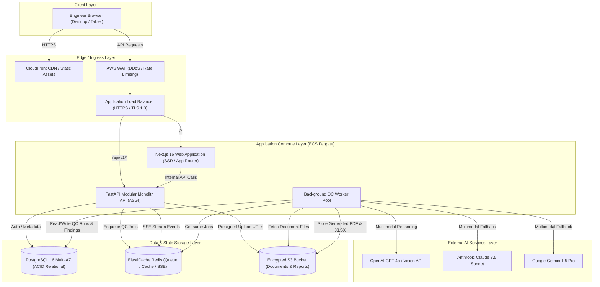
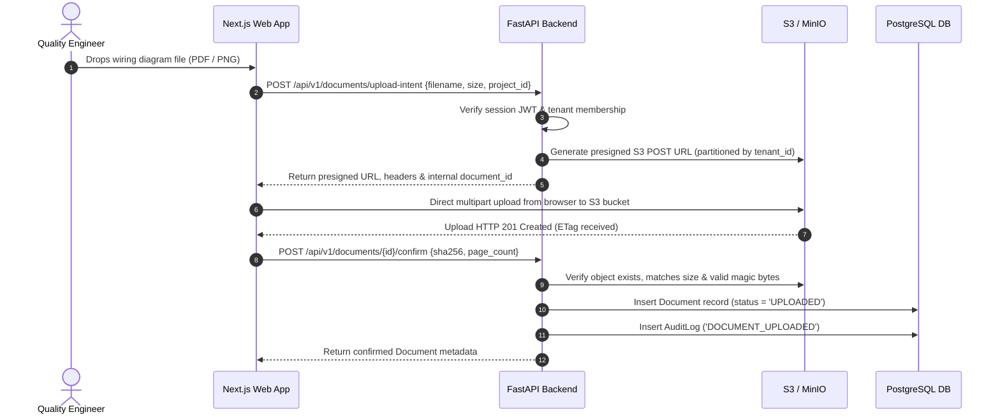
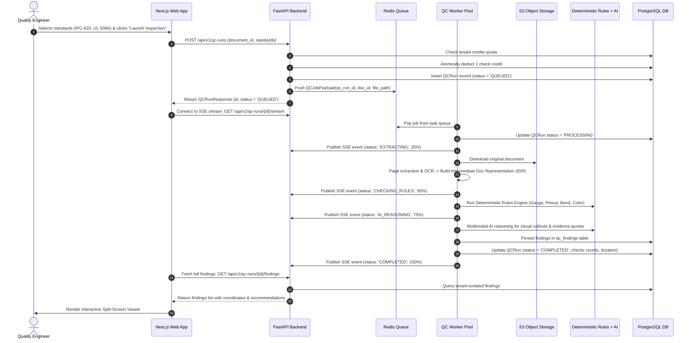
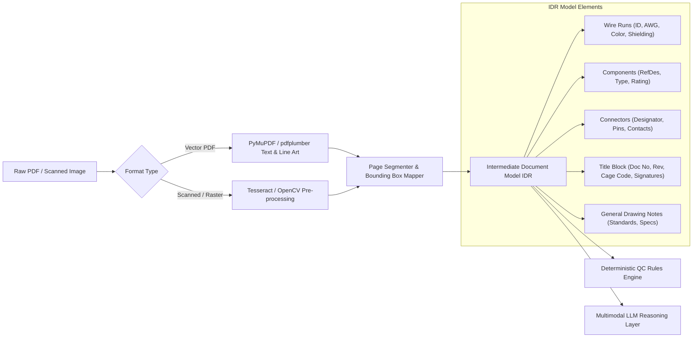

# System Architecture Document

**Project**: Wiring Diagram QC Assistant  
**Client**: Spandsons Horizon Engineering Pvt. Ltd.  
**Version**: 2.0.0 (Phase 0 Architecture Release)  
**Date**: 2026-09-25  

---

## 1. Architectural Philosophy & Principles

The Wiring Diagram QC Assistant is engineered as a **Modular Monolith** with decoupled background workers. This pattern avoids the premature operational overhead, network latency, and distributed transaction complexity of microservices, while enforcing strict domain boundaries that allow individual services to be extracted into independent containers should scale require it.

Core engineering principles:
1. **Clean Domain Boundaries**: Business rules and engineering validations reside entirely within pure Python domain modules, independent of frameworks (FastAPI), databases (SQLAlchemy), or AI SDKs.
2. **Deterministic Rules Ahead of AI**: Generative AI is never treated as the authoritative ground truth for safety-critical engineering checks. A deterministic rules engine runs first; the AI layer provides multimodal contextual understanding, OCR disambiguation, and plain-language remedial explanations.
3. **Defense-in-Depth Multi-Tenancy**: Tenant isolation is enforced at the database query level, API dependency injection layer, and storage path partitioning. Tenant IDs are derived exclusively from cryptographically signed session tokens, never from unverified request payloads.
4. **Asynchronous Non-Blocking Processing**: Long-running document parsing, OCR, and AI analysis are strictly executed in background worker pools via task queues. Synchronous HTTP endpoints never block on heavy document workloads.

---

## 2. High-Level System Architecture Diagram



---

## 3. Component Map & Layered Architecture

```
┌────────────────────────────────────────────────────────────────────────┐
│                        1. PRESENTATION LAYER                           │
│  - Next.js 16 Web Application (App Router, React 19, TypeScript)       │
│  - FastAPI REST Endpoints (/api/v1/auth, /projects, /documents, /qc)   │
│  - Server-Sent Events (SSE) Progress Broadcaster                       │
└───────────────────────────────────┬────────────────────────────────────┘
                                    │
┌───────────────────────────────────▼────────────────────────────────────┐
│                        2. APPLICATION LAYER                            │
│  - Auth & RBAC Security Guards (JWT, Salted Bcrypt, Role Hierarchies)  │
│  - QC Job Orchestration Service (State Machine Management)             │
│  - Document Ingestion Service (MIME Sniffing, Checksums, S3 Staging)   │
│  - Report Generation Service (ReportLab PDF & OpenPyXL XLSX)          │
│  - Metering & Credit Consumption Service                               │
└───────────────────────────────────┬────────────────────────────────────┘
                                    │
┌───────────────────────────────────▼────────────────────────────────────┐
│                          3. DOMAIN LAYER                               │
│  - Intermediate Document Representation (IDR) Schemas                  │
│  - Deterministic Rule Engine & Rule Pack Registry                      │
│  - Engineering Domain Entities: WireNet, Terminal, Connector, Finding │
│  - Evaluation & Precision/Recall Metrics Engine                        │
└───────────────────────────────────┬────────────────────────────────────┘
                                    │
┌───────────────────────────────────▼────────────────────────────────────┐
│                     4. INFRASTRUCTURE LAYER                            │
│  - SQLAlchemy 2.0 Async PostgreSQL Repositories                        │
│  - Redis Task Queue & Distributed Locking Adapters                     │
│  - AWS S3 / MinIO Object Storage Adapter                               │
│  - AI Provider Adapters (OpenAI, Anthropic, Gemini, Mock Engine)       │
│  - Document Parsers (PyMuPDF, pdfplumber, OpenCV, Tesseract OCR)      │
└────────────────────────────────────────────────────────────────────────┘
```

---

## 4. End-to-End Request & Execution Flows

### 4.1 Document Upload & Registration Flow



### 4.2 QC Inspection & Background Worker Flow



---

## 5. Document Processing Pipeline & Intermediate Document Representation (IDR)

To decouple raw file formats from quality checking, all documents pass through a normalization pipeline producing a structured **Intermediate Document Representation (IDR)**:



Every extracted entity in the IDR retains its **provenance**:
- `document_id`: UUID of the parent document.
- `page_number`: 1-indexed page where the element appears.
- `location_bbox`: Spatial coordinates `[x, y, width, height]` in normalized percentages $(0.0 - 1.0)$ relative to page dimensions, guaranteeing that bounding boxes display accurately on any screen resolution.
