# Database Schema & Data Modeling Document

**Project**: Wiring Diagram QC Assistant  
**Client**: Spandsons Horizon Engineering Pvt. Ltd.  
**Version**: 2.0.0 (Phase 0 Architecture Release)  
**Date**: 2026-09-25  

---

## 1. Database Philosophy & Design Rules

The platform utilizes **PostgreSQL 16** as its primary relational datastore. The schema adheres to strict production engineering rules:
1. **Strict Tenant Partitioning**: Every tenant-owned entity includes an `organization_id` foreign key with indexed foreign key constraints and query-level scoping.
2. **UUID Primary Keys**: All primary keys are 36-character UUIDv4 strings generated application-side or via `gen_random_uuid()` to prevent ID enumeration and ease data export/sharding.
3. **UTC Timestamps**: All temporal fields (`created_at`, `updated_at`, `completed_at`) are stored as `TIMESTAMP WITH TIME ZONE` in UTC.
4. **Normalized Structure with Structured JSON**: Relational integrity is enforced for core business entities (tenants, users, projects, documents, runs, findings, audit logs), while semi-structured metadata (bounding boxes, rule parameters, raw LLM reasoning payloads) is stored in PostgreSQL `JSONB` with GIN indexing capability.
5. **Alembic Reversible Migrations**: Zero manual schema alterations in any environment. All DDL operations must be version-controlled via reversible Alembic migration scripts.
6. **Soft Deletion**: Sensitive assets (`documents`, `projects`, `qc_runs`) support soft deletion (`deleted_at TIMESTAMP NULL`) to preserve audit trails while removing them from active tenant views.

---

## 2. Complete Entity-Relationship Diagram (ERD)

```mermaid
erDiagram
    ORGANIZATIONS ||--o{ USERS : "employs"
    ORGANIZATIONS ||--o{ PROJECTS : "owns"
    ORGANIZATIONS ||--o{ DOCUMENTS : "uploads"
    ORGANIZATIONS ||--o{ QC_RUNS : "executes"
    ORGANIZATIONS ||--o{ AUDIT_LOGS : "logs"
    ORGANIZATIONS ||--o{ SUBSCRIPTIONS : "subscribes"
    ORGANIZATIONS ||--o{ USAGE_RECORDS : "records"

    PROJECTS ||--o{ DOCUMENTS : "contains"
    DOCUMENTS ||--o{ DOCUMENT_PAGES : "segments"
    DOCUMENTS ||--o{ QC_RUNS : "analyzed_in"

    STANDARDS ||--o{ RULE_PACKS : "packages"
    RULE_PACKS ||--o{ RULE_PACK_RULES : "contains"
    RULES ||--o{ RULE_PACK_RULES : "included_in"

    QC_RUNS ||--o{ QC_CHECKS : "evaluates"
    QC_RUNS ||--o{ FINDINGS : "detects"
    QC_RUNS ||--o{ REPORTS : "compiles"

    FINDINGS ||--o{ FINDING_FEEDBACK : "receives"
    FINDINGS }o--|| RULES : "violates"

    REPORTS ||--o{ REPORT_FILES : "generates"

    ORGANIZATIONS {
        uuid id PK
        varchar name
        varchar slug UK
        varchar plan_tier
        int credits_remaining
        jsonb settings
        timestamp created_at
        timestamp updated_at
    }

    USERS {
        uuid id PK
        uuid organization_id FK
        varchar email UK
        varchar hashed_password
        varchar full_name
        varchar role
        boolean is_active
        timestamp created_at
        timestamp updated_at
    }

    PROJECTS {
        uuid id PK
        uuid organization_id FK
        varchar name
        text description
        timestamp created_at
        timestamp deleted_at
    }

    DOCUMENTS {
        uuid id PK
        uuid organization_id FK
        uuid project_id FK
        varchar filename
        bigint file_size_bytes
        varchar mime_type
        varchar sha256_checksum
        varchar storage_path
        int page_count
        varchar status
        timestamp created_at
        timestamp deleted_at
    }

    DOCUMENT_PAGES {
        uuid id PK
        uuid document_id FK
        int page_number
        int width_px
        int height_px
        varchar image_storage_path
        jsonb extracted_text_blocks
        timestamp created_at
    }

    STANDARDS {
        uuid id PK
        varchar code UK
        varchar name
        varchar revision
        text description
        boolean is_active
    }

    RULE_PACKS {
        uuid id PK
        uuid standard_id FK
        varchar name
        varchar version
        text description
        boolean is_default
    }

    RULES {
        uuid id PK
        varchar rule_code UK
        varchar category
        varchar name
        text description
        varchar default_severity
        text standard_clause
        jsonb default_parameters
        boolean is_active
    }

    RULE_PACK_RULES {
        uuid id PK
        uuid rule_pack_id FK
        uuid rule_id FK
        varchar severity_override
        jsonb parameter_overrides
    }

    QC_RUNS {
        uuid id PK
        uuid organization_id FK
        uuid document_id FK
        uuid initiated_by FK
        varchar overall_status
        int checks_total
        int checks_passed
        int checks_failed
        int checks_review
        int critical_count
        int major_count
        int minor_count
        varchar model_version
        varchar prompt_version
        varchar rules_version
        int processing_time_ms
        timestamp created_at
        timestamp completed_at
    }

    QC_CHECKS {
        uuid id PK
        uuid qc_run_id FK
        uuid rule_id FK
        varchar status
        text message
        timestamp executed_at
    }

    FINDINGS {
        uuid id PK
        uuid qc_run_id FK
        uuid rule_id FK
        varchar finding_code
        varchar category
        varchar severity
        float confidence_score
        varchar confidence_level
        int page_number
        jsonb location_bbox
        text title
        text description
        text evidence_text
        text requirement_text
        text standard_citation
        text recommendation
        varchar status
        timestamp created_at
    }

    FINDING_FEEDBACK {
        uuid id PK
        uuid finding_id FK
        uuid reviewer_id FK
        varchar feedback_status
        text reviewer_comment
        timestamp submitted_at
    }

    REPORTS {
        uuid id PK
        uuid qc_run_id FK
        uuid organization_id FK
        varchar report_number UK
        varchar status
        timestamp generated_at
    }

    REPORT_FILES {
        uuid id PK
        uuid report_id FK
        varchar file_type
        varchar storage_path
        bigint file_size_bytes
        varchar sha256_checksum
        timestamp created_at
    }

    AUDIT_LOGS {
        uuid id PK
        uuid organization_id FK
        uuid actor_id FK
        varchar action
        varchar resource_type
        uuid resource_id
        varchar ip_address
        varchar user_agent
        jsonb event_metadata
        timestamp created_at
    }

    SUBSCRIPTIONS {
        uuid id PK
        uuid organization_id FK
        varchar plan_tier
        varchar billing_provider
        varchar provider_subscription_id
        int check_quota_monthly
        timestamp current_period_start
        timestamp current_period_end
        varchar status
    }

    USAGE_RECORDS {
        uuid id PK
        uuid organization_id FK
        varchar metric_name
        int quantity
        timestamp recorded_at
    }
```



---

## 3. Database Indexes & Performance Optimization

To guarantee sub-100ms response times for high-volume dashboard queries and report rendering, strict indexes are defined:

```sql
-- Multi-Tenant Isolation & Lookups
CREATE INDEX idx_users_org ON users(organization_id);
CREATE INDEX idx_projects_org ON projects(organization_id) WHERE deleted_at IS NULL;
CREATE INDEX idx_documents_org ON documents(organization_id) WHERE deleted_at IS NULL;
CREATE INDEX idx_documents_project ON documents(project_id) WHERE deleted_at IS NULL;

-- QC Run & Findings Queries
CREATE INDEX idx_qc_runs_org ON qc_runs(organization_id);
CREATE INDEX idx_qc_runs_document ON qc_runs(document_id);
CREATE INDEX idx_qc_runs_status ON qc_runs(overall_status);
CREATE INDEX idx_findings_run_severity ON findings(qc_run_id, severity);
CREATE INDEX idx_findings_page ON findings(qc_run_id, page_number);

-- Compliance Audit Log (Chronological Append)
CREATE INDEX idx_audit_logs_org_created ON audit_logs(organization_id, created_at DESC);
CREATE INDEX idx_audit_logs_actor ON audit_logs(actor_id);
CREATE INDEX idx_audit_logs_action ON audit_logs(action);

-- Checksum Deduplication
CREATE INDEX idx_documents_checksum ON documents(organization_id, sha256_checksum);
```
