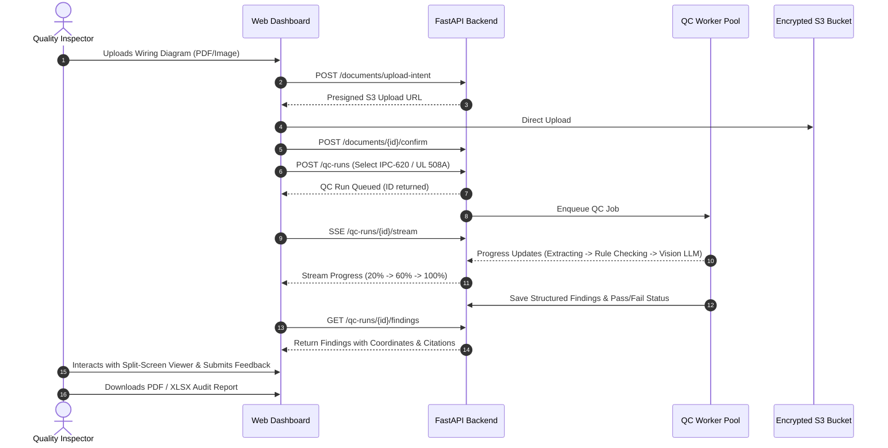

# Product Requirements Document (PRD)
**Project**: Wiring Diagram QC Assistant  
**Client / Product Owner**: Spandsons Horizon Engineering Pvt. Ltd. (Pravin, Gogulnath)  
**Version**: 1.0.0 | **Date**: 2026-09-25

---

## 1. Product Vision & Positioning
The Wiring Diagram QC Assistant transforms manual, high-overhead electrical wiring diagram quality inspections into an automated, verifiable, and standards-compliant SaaS workflow. It provides engineers and quality inspectors in EMS, wire harness manufacturing, and panel building with instant, evidence-backed defect reports.

## 2. Core Value Proposition
- **Turnaround Time**: Reduces manual drawing review from hours to under 3 minutes.
- **Defect Detection**: Prevents costly downstream production errors (e.g., incorrect wire gauges, unrated terminal lugs, pinout mismatches, missing title block approvals).
- **Standards Traceability**: Flags discrepancies with exact citations against industry standards (IPC-WHMA-A-620, IPC-A-610, UL 508A) and customer SOPs.
- **Audit Compliance**: Provides an immutable audit trail and verifiable PDF/XLSX export for customer and regulatory compliance.

## 3. User Workflows

## 4. Key Functional Features (MVP)
1. **Multi-Tenant Account Management**: Self-service organization creation, user roles (Owner, Admin, Engineer, Inspector, Viewer).
2. **Secure Upload & Storage**: PDF and image ingestion with magic-byte validation and anti-decompression bomb protection.
3. **Dual Parsing Engine**: Vector text extraction for digital CAD PDFs + high-resolution OCR (Tesseract / PaddleOCR) for raster scans.
4. **Hybrid QC Analysis**: Deterministic rule evaluation combined with multi-modal LLM reasoning and Pydantic schema enforcement.
5. **Interactive Review UI**: Synchronized split-screen showing document page with severity-colored bounding box overlays alongside finding cards.
6. **One-Click Export**: Generation of audit-grade PDF and structured Excel spreadsheets.
7. **Human Feedback Loop**: Inspection team flags findings as Correct, Incorrect (False Positive), or Needs Review to continuously improve accuracy.
8. **Usage & Metering**: Pay-per-check credit tracking and subscription tier quota enforcement.
